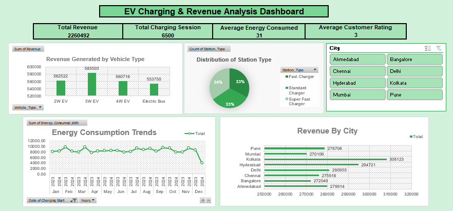

# EV Charging & Revenue Analysis Dashboard (Excel Project)

## 📊 Project Overview
This project analyzes EV charging behavior, revenue generation, station usage, and energy consumption using Microsoft Excel. The goal was to uncover charging trends, identify high-performing cities and vehicle categories, and generate actionable business recommendations through an interactive dashboard.

The dashboard helps stakeholders understand customer usage patterns, optimize charging infrastructure, and improve operational efficiency.

The analysis was performed on **6000+ EV charging records**, providing meaningful insights into customer behavior and charging trends.

---

## 🎯 Objectives
- Analyze EV charging data to identify revenue and usage trends
- Compare charging performance across vehicle types and cities
- Evaluate energy consumption behavior over time
- Understand customer satisfaction through ratings analysis
- Generate actionable recommendations for business growth
- Present insights through an interactive Excel dashboard

---

## 🛠️ Tools & Techniques Used
- Microsoft Excel
- Data Cleaning & Preprocessing
- Pivot Tables & Pivot Charts
- Excel Formulas & Functions
- Conditional Formatting
- Interactive Dashboard Design
- KPI Reporting & Visualization

---

## 📈 Dashboard Features
- KPI Metrics:
  - Total Revenue
  - Charging Sessions
  - Energy Consumed
  - Average Customer Rating

- Revenue analysis by vehicle type
- City-wise revenue comparison
- Charging station type distribution
- Energy consumption trends over time
- Customer rating analysis
- Interactive filters and visualizations

---

## 💡 Key Insights & Business Interpretation

### 🚗 3W EVs Generate the Highest Revenue
Three-wheeler EVs contribute the highest share of revenue, indicating strong adoption and charging demand in this category.

**Business Impact:**  
The company can prioritize infrastructure and service plans tailored for 3W EV users to maximize profitability.

---

### ⚡ Fast & Super Fast Chargers Are Most Preferred
Users heavily rely on fast charging stations due to convenience and reduced waiting time.

**Business Impact:**  
Expanding fast-charging infrastructure can improve customer retention and increase charging frequency.

---

### 📈 Energy Consumption Varies Over Time
Energy usage trends fluctuate across different periods, reflecting changing customer charging behavior and peak demand hours.

**Business Impact:**  
Understanding peak usage periods can help optimize electricity distribution and reduce operational inefficiencies.

---

### 🌆 Kolkata Generates the Highest Revenue
Kolkata outperforms other cities in total charging revenue, followed by Hyderabad and Pune.

**Business Impact:**  
This indicates higher EV adoption and charging demand in these regions. Businesses can focus marketing efforts and infrastructure expansion in high-performing cities to increase market share.

---

### ⭐ Customer Ratings Show Scope for Improvement
Customer satisfaction ratings are moderate, suggesting areas where service quality and user experience can be improved.

**Business Impact:**  
Improving station maintenance, reducing waiting time, and enhancing customer support can increase user satisfaction and brand loyalty.

---

## 📌 Recommendations
- Increase investment in fast and super-fast charging stations to meet growing demand.
- Expand charging infrastructure in high-revenue cities like Kolkata, Hyderabad, and Pune.
- Introduce customer loyalty programs and promotional campaigns to improve retention.
- Monitor charging peak hours to optimize energy distribution and station availability.
- Improve customer experience through better maintenance, cleaner stations, and faster issue resolution.
- Focus on 3W EV charging solutions as they represent a major revenue-driving segment.

---

## 📊 Dashboard Preview
The dashboard below provides interactive insights into EV charging trends, revenue performance, customer behavior, and energy consumption patterns.

---

## 📁 Project File
[Download Excel Dashboard](EV_Charging_Analysis_Dashboard.xlsx)

---

## 🚀 Conclusion
This project demonstrates how Excel can be used for end-to-end data analysis and dashboard development. By transforming raw EV charging data into meaningful insights and actionable recommendations, the dashboard supports data-driven decision-making and business strategy development.

It also highlights practical skills in data cleaning, visualization, KPI analysis, and business insight generation using Microsoft Excel.
